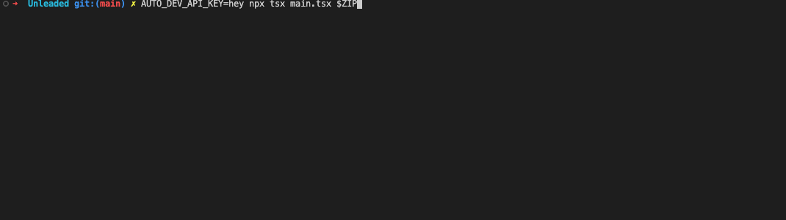

# Unleaded cli

This is an interactive cli to search car listings.

```bash
AUTO_DEV_API_KEY=xxx npx tsx main.tsx -z <zip> [-b <brand>] [-m <model>] [-d <distance>] [-e <engine>]
```

Options:
- `-z, --zip` - Zip code for search location (required)
- `-b, --brand` - Brand/make name (e.g., Hyundai, Tesla)
- `-m, --model` - Model name (e.g., Ioniq 5, Model 3)
- `-d, --distance` - Search radius in miles (default: 50)
- `-e, --engine` - Engine type (default: electric)

Use `--wizard` for interactive mode or `--help` for full usage info.

# Requirements

Using `api.auto.dev` API, register and get api key to use this cli. auto.dev provides enough free searches per month to find a good deal.

# Features

Caches content to re-use data.

Interactive, instant sorting by various parameters (price, cpo flag etc). Basic search to find dealer names.

Clicable links to the car image and carfax reports.



# Tech stack

Created with [Effect](http://effect.website) for declarative coding, [ink](https://github.com/vadimdemedes/ink) for terminal UI, [Effect Atom](https://github.com/tim-smart/effect-atom/blob/main/README.md) for the state, [Projen](https://github.com/projen/projen) for the project and deps management, and the usual AI involment.

# Contributions

Hack away on it with your fav agent :)
